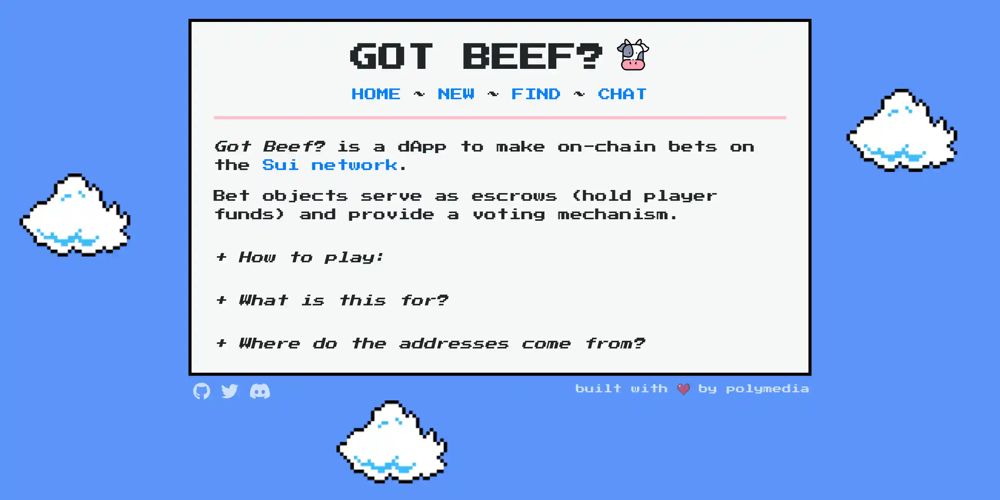

# Got Beef?

A [Sui](https://sui.io/) dApp to create on-chain bets. It comes with a built-in escrow and voting functionality.

- Anybody can create a new bet between 2 or more players.
- The winner is selected by a single judge, or by a quorum of judges.
- Funds can only be transferred to the winner, or refunded back to the players.

Tired of [escrowing millions](https://twitter.com/GiganticRebirth/status/1503335929976664065) for your Twitter friends? Try _Got Beef?_.
